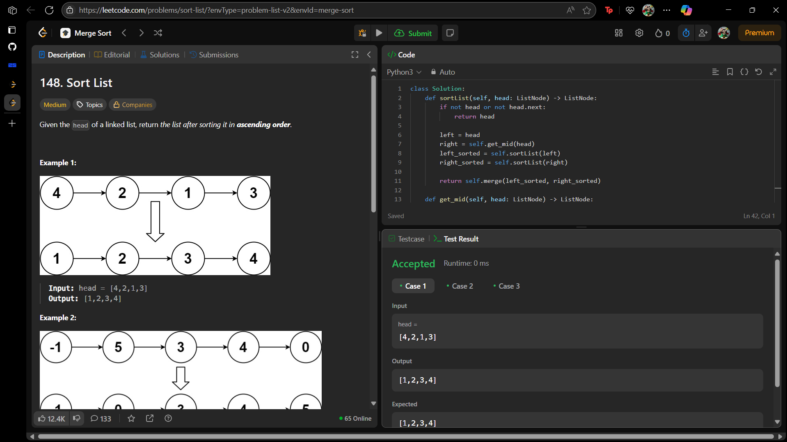

# 148. Sort List

O arquivo [LC148.py](./LC148.py) apresenta a resolução do exercício número 148 sobre *merge sort* da plataforma LeetCode.

A resolução foi aceita pela plataforma, conforme a **Figura 1** abaixo:

**Figura 1** - Resolução da questão 148.

## Explicação da solução

Foi o utilizado o *Merge Sort* para resolver o problema. Esse algoritmo se encaixa na categoria "dividir e conquistar", visto que a lista original é dividida em duas partes. Em seguida, as duas sub-listas são recursivamente ordenadas. A recursão continua até que tenhamos sub-listas com apenas um ou nenhum elemento, que são, por definição, consideradas ordenadas. Por fim, combinamos as sub-listas ordenadas para formar uma única lista ligada ordenada.

1. Divisão

O primeiro passo é encontrar o meio da lista para dividi-la. Uma técnica comum para isso é usar dois ponteiros: um "lento" (slow) que avança um nó de cada vez e um "rápido" (fast) que avança dois nós de cada vez. Quando o ponteiro fast chegar ao final da lista, o ponteiro slow estará no meio.

Lista Original: [4, 2, 1, 3]

Encontra o meio. O ponteiro slow para no 2.

Quebra a lista em duas:

Lista Esquerda: [4, 2]

Lista Direita: [1, 3]

2. Conquista (Recursão)

O algoritmo aplica o mesmo processo recursivamente para cada sub-lista.

Analisando a Lista Esquerda [4, 2]:

Dividir: [4] e [2]

Conquistar: As listas [4] e [2] já têm um único elemento, então são consideradas ordenadas.

Combinar (*Merge*): Mescla [4] e [2] para obter [2, 4].

Analisando a Lista Direita [1, 3]:

Dividir: [1] e [3]

Conquistar: Ambas são listas de um elemento e já estão ordenadas.

Combinar (*Merge*): Mescla [1] e [3] para obter [1, 3].

3. Combinação Final

Agora que o algoritmo possui as duas metades ordenadas, [2, 4] e [1, 3], ele faz a mesclagem (*merge*) final.

O processo de "*merge*" compara os nós iniciais de cada lista e pega o menor para ser o próximo nó da lista final.

Compara 2 e 1. 1 é menor. Lista resultante: [1]

A lista da direita avança para 3. Compara 2 e 3. 2 é menor. Lista resultante: [1, 2]

A lista da esquerda avança para 4. Compara 4 e 3. 3 é menor. Lista resultante: [1, 2, 3]

A lista da direita não tem mais elementos. Pega o que resta da lista da esquerda (4).

Lista Final Ordenada: [1, 2, 3, 4]

4. Análise de Complexidade (*Follow-up*)

A pergunta de "*follow-up*" questiona se é possível ordenar a lista em tempo O(n log n) e com espaço de memória O(1) (constante).

**Complexidade de Tempo:** O(n log n)

O processo de dividir a lista ao meio leva, em cada nível da recursão, um tempo proporcional ao número de elementos, ou seja, O(n).

Como dividimos a lista pela metade a cada passo, a profundidade da recursão é log n.

Portanto, a complexidade total de tempo é O(n log n), o que é ideal para algoritmos de ordenação baseados em comparação.

**Complexidade de Espaço:** O(log n) vs O(1)

A implementação recursiva do *Merge Sort* utiliza espaço na pilha de chamadas da recursão. A profundidade da recursão é log n, então o espaço de memória usado pela pilha é O(log n).

A pergunta pede por O(1) de espaço. A implementação recursiva padrão não atende a esse requisito estrito de espaço constante. Para alcançar O(1) de espaço, seria necessário um *Merge Sort* "*in-place*", sendo de difícil implementação.

O algoritmo garante a complexidade de tempo O(n log n) com uma complexidade de espaço O(log n).