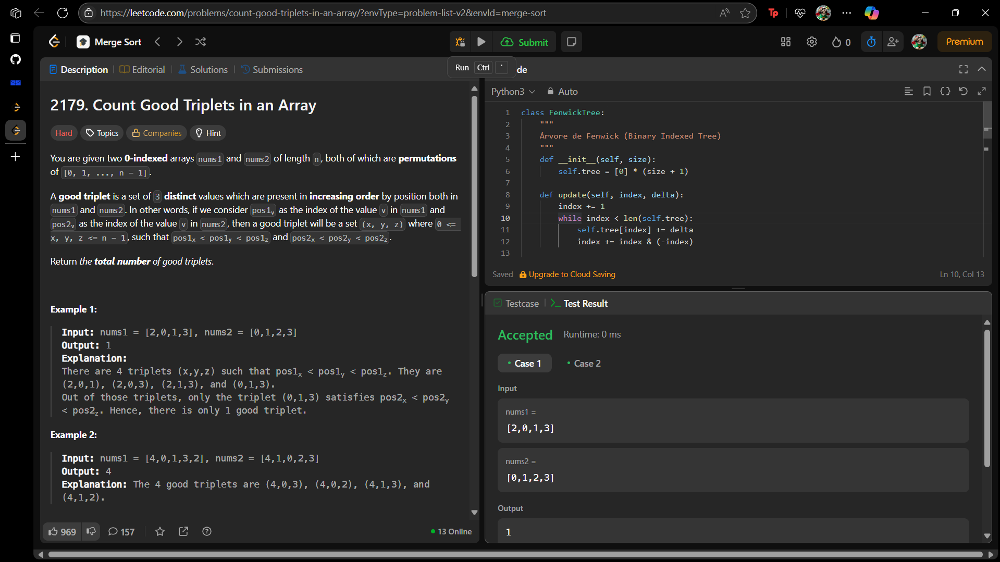

# 2179. Count Good Triplets in an Array

O arquivo [LC2179.py](./LC2179.py) apresenta a resolução do exercício número 2179 sobre *merge sort* da plataforma LeetCode.

A resolução foi aceita pela plataforma, conforme a **Figura 1** abaixo:

**Figura 1** - Resolução da questão 2179.

## Explicação da solução

A implementação final usa uma estrutura de dados chamada Árvore de Fenwick (*Fenwick Tree*) ou Árvore de Índices Binários (*Binary Indexed Tree - BIT*), que é eficiente para os cálculos necessário para a questão 2179.

A definição de um "trio bom" (x, y, z) é que suas posições estejam em ordem crescente em ambos os arrays:

pos1[x] < pos1[y] < pos1[z]

pos2[x] < pos2[y] < pos2[z]

Para resolver isso, é necessário fixar a ordem de um dos arrays e ver como as posições do outro se comportam.

Para cada elemento A[j] no novo array, ele pode ser o elemento do meio (y) de um trio. Para que isso aconteça, precisamos encontrar:

menores_a_esquerda: O número de elementos A[i] (com i < j) que são menores que A[j].

maiores_a_direita: O número de elementos A[k] (com k > j) que são maiores que A[j].

Para cada j, o número de trios bons onde A[j] é o elemento do meio é menores_a_esquerda * maiores_a_direita. O resultado final será a soma desses produtos para todos os j possíveis.

Calcular isso para cada j levaria a um tempo de O(n^2), o que é lento demais.

**A Solução com Árvore de Fenwick (BIT)**
Uma BIT permite:

1. Adicionar um número em uma coleção: update(index, delta) em O(log n).

2. Consultar a soma cumulativa até um certo índice: query(index) em O(log n).

**Calcular menores_a_esquerda:**

Inicializa uma BIT (com todos os valores zero) e a percorre da esquerda para a direita (de j = 0 a n-1). Para cada A[j], o número de elementos menores já vistos é BIT.query(A[j] - 1). Armazena isso em um array menores_a_esquerda. Após a consulta, adiciona A[j] à BIT com BIT.update(A[j], 1).

**Calcular maiores_a_direita:**

Inicializa uma nova BIT e percorre-a da direita para a esquerda (de j = n-1 a 0). Para cada A[j], o número de elementos maiores já vistos é (total de elementos já na BIT) - BIT.query(A[j]). Após a consulta, adiciona A[j] à BIT com BIT.update(A[j], 1).

Resultado Final: soma(menores_a_esquerda[j] * maiores_a_direita[j]) para j de 0 a n-1.