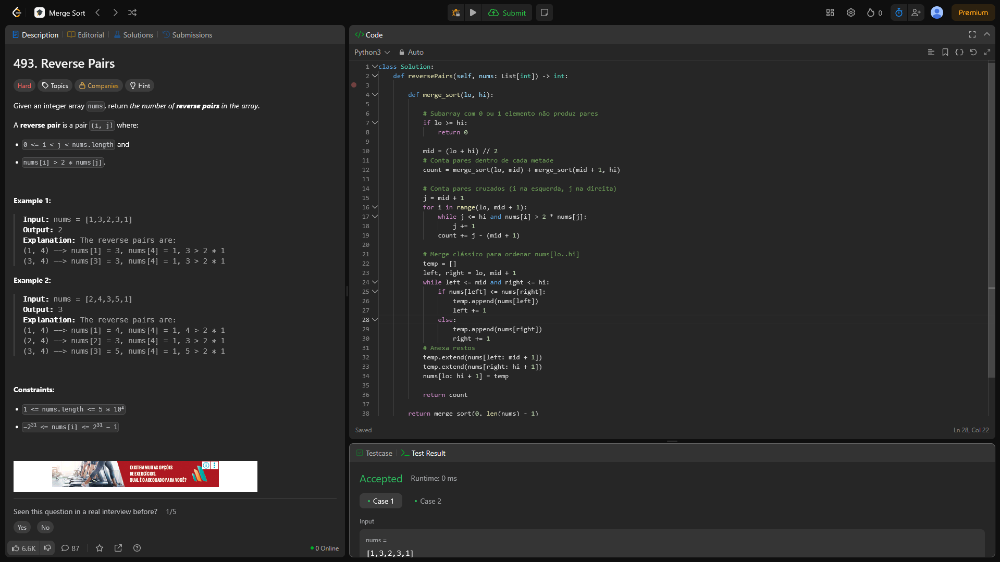

# 493. Sort an Array

O arquivo [LC493.py](./LC493.py) apresenta a resolução do exercício número 493 sobre *merge sort* da plataforma LeetCode.

A resolução foi aceita pela plataforma, conforme a **Figura 1** abaixo:

**Figura 1** - Resolução da questão 493.

## Explicação da solução

A solução aplicada utiliza uma implementação de *Heap Sort* que atende aos requisitos da questão:
  - Tempo de execução garantido em O(n log n) no pior caso;
  - Não uso de funções internas de ordenação;
  - Uso mínimo de memória adicional.

1. Inicialmente, é construído um Max-Heap, ou seja, uma árvore binária completa onde cada nó é maior ou igual ao seus filhos.
   - Cada heapify(nums, n, i) faz comparações e, se necessário, troca o valor nums[i] com um de seus filhos maiores, e repete isso recursivamente. Essa fase leva O(n) tempo.

2. Depois é feita a ordenação propriamente dita.
   - Troca-se o índice 0 (o maior do heap) com o elemento do final do array ainda não ordenado (end).
   - Reduzimos o “tamanho do heap” em 1 (heap_size = end) para excluir o maior elemento que já colocamos na posição correta.
   - Chamamos heapify(nums, end, 0) para restaurar a propriedade de max-heap na raiz.
   - Repetimos até que só reste um elemento. Cada iteração faz O(log n) comparações/trocas, totalizando O(n log n).
