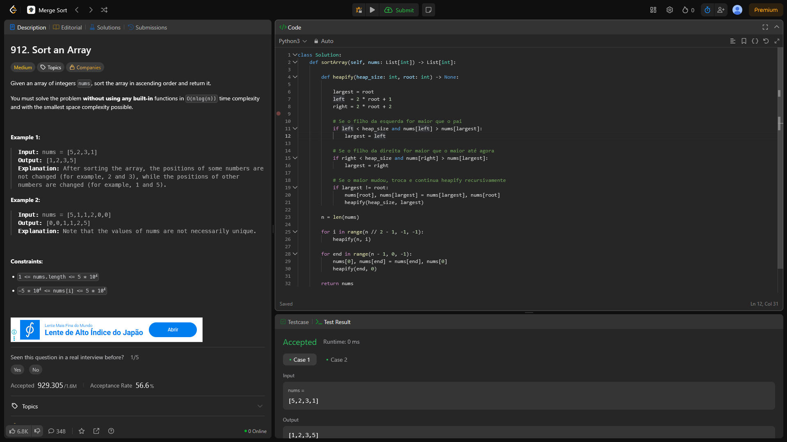

# 912. Sort an Array

O arquivo [LC912.py](./LC912.py) apresenta a resolução do exercício número 493 sobre *merge sort* da plataforma LeetCode.

A resolução foi aceita pela plataforma, conforme a **Figura 1** abaixo:

**Figura 1** - Resolução da questão 912.

## Explicação da solução

A solução aplicada utiliza uma implementação de *Merge Sort* recursivamente que atende aos requisitos da questão:
  - Tempo de execução garantido em O(n log n) no pior caso.

1. A ideia de resolução é a "padrão" do *merge sort*: resolver o problema em metades, resolver recursivamente e, por fim, combinar os resultados das metades.
2. Além de ordenar, no momento do *merge* conta-se quantos pares i < j satisfazem nums[i] > 2*nums[j].
3. Realiza-se a divisão recursiva (merge_sort) apenas se o subarray tem tamanho > 1. Se não, se o subarray tem tamanho ≤ 1, não há pares — retorna 0.
   - Calcula mid e conta os pares na metade esquerda e na metade direita recursivamente.
4. Contagem de pares cruzados:
   - Após contar os pares internos às metades, precisamos contar os pares onde i está na esquerda e j na direita.
   - Para cada i em [lo..mid], buscamos o primeiro j em [mid+1..hi] tal que nums[i] ≤ 2*nums[j].
   - Enquanto nums[i] > 2*nums[j], avançamos j. Se ao final j0 foi o primeiro a não satisfazer, então todos em [mid+1..j0-1] formam reverse pairs com este i.
   - Somamos j0 - (mid+1) ao contador.
5. Para ordenar o segmento, utilizamos dois ponteiros (left e right) para percorremos as metades ordenadas e construímos um array temp também ordenado.
   - Copiamos temp de volta para nums[lo..hi], garantindo que em níveis superiores da recursão o array permaneça ordenado para as contagens de pares.

Complexidade: Cada nível de recursão faz O(n) de trabalho (contagem + merge), e temos O(log n) níveis → O(n log n) no total.
